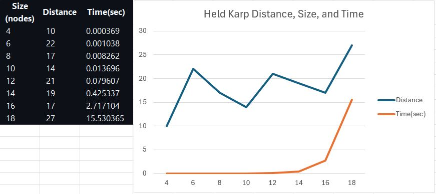
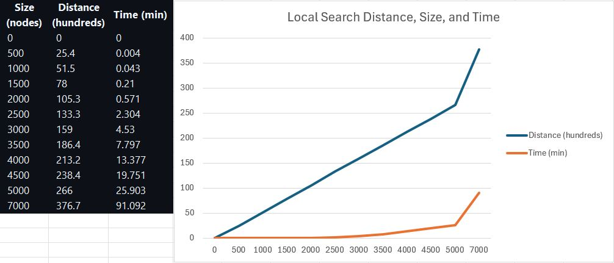
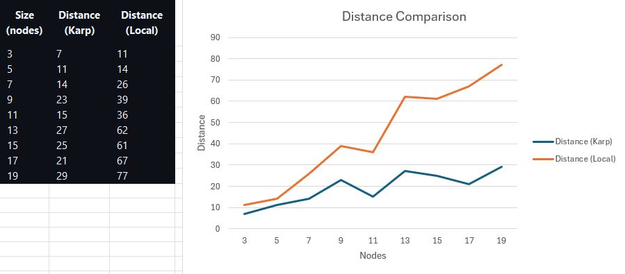
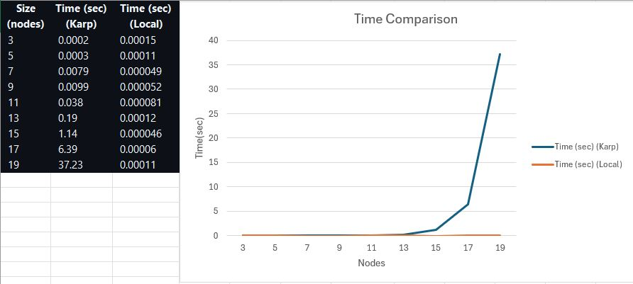

# Traveling Salesperson Problem -- Empirical Analysis

For this exercise, you'll need to take the code from the TSP Held-Karp and TSP
Local Search exercises. This can be your own implementation or somebody else's.
You will now do an empirical analysis of the implementations, comparing their
performance. Both the Held-Karp and the Local Search algorithms solve the same
problem, but they do so in completely different ways. This results in different
solutions, and in different times required to get to the solution.

Investigate the implementations' empirical time complexity, i.e. how the runtime
increases as the input size increases. *Measure* this time by running the code
instead of reasoning from the asymptotic complexity (this is the empirical
part). Create inputs of different sizes and plot how the runtime scales (input
size on the $x$ axis, time on the $y$ axis). Your largest input should have a
runtime of *at least* an hour. The input size that gets you to an hour will
probably not be the same for the Held-Karp and Local Search implementations.

In addition to the measured runtime, plot the tour lengths obtained by both
implementations on the same input distance matrices. The length of the tour that
Held-Karp found should always be less than or equal to the tour length that
Local Search found. Why is this?

Add the code to run your experiments, graphs, and an explanation of what you did
to this markdown file.

## Experiment Explanation
There are three test files in this repo, testKarp, testLocal, and compareTSP. TestKarp and testLocal both go to the extremes of their given algorithms, starting from low node counts to where the program exceeded an hour. The test code runs the loop and times how long each iteration takes, as well as the distance. The matrices were randomly generated each time. This is just useful to see overall growth rates and usefulness limitations. CompareTSP runs both algorithms on the same matrices to determine speed differences and compare the best distance found by each algorithm for a given generated matrix. Below are the results of these three tests.

## Held Karp Experiment
Here is an example set of data for various sizes of inputs.
| Size (nodes) | Distance | Time(sec)|
| ------------- | ------------- | ---- |
|4 |10 |0.000369  |
|6 |22 |0.001038  |
|8 |17 |0.008262  |
|10 |14 |0.013696  |
|12 |21 |0.079607  |
|14 |19 |0.425337  |
|16 |17 |2.717104  |
|18 |27 |15.530365  |

This graph shows this information:

We can see that the time is exponential.

Took over two hours to run for 20 nodes until I stopped the execution. I don't know why this is such a massive jump, but it probably has to do with memory issues if I had to guess.

## Local Search Experiment
Local search scaling by hundreds and thousands, local search runs far faster, and scales clearly linearly.
| Size (nodes)  | Distance | Time (min) |
| ------------- | ------------- | ---- |
|  0 | 0  | 0 |
|  500 | 2542  | 0.004 |
|  1000 | 5155  |0.043  |
|  1500 | 7798  | 0.210 |
|  2000 | 10525  |0.571  |
|2500	|13325|			2.304|	
|3000	|15898			|4.530|
|3500|	18644		|	7.797|
|4000	|21315	|		13.377|
|4500	|23838|			19.751|
|5000	|26596|			25.903|
|7000 |37666| 91.092|

This can be displayed in this graph:

## Comparing Local Search and Held Karp
Below are the results of comparing the local search and held karp algorithms against the same randomly generated matrices of indexes from 3 to 19.
| Size (nodes)  | Distance (Karp) | Time (sec) (Karp) | Distance (Local) | Time (sec) (Local) |
| ------------- | ------------- | ---- | ------------ | ---- |
| 3   | 7  | 0.0002   | 11  | 0.00015  |
| 5   | 11  | 0.0003   | 14  | 0.00011    |
| 7   | 14  | 0.0079   | 26  | 0.000049   |
| 9   | 23  | 0.0099   | 39  | 0.000052   |
| 11  | 15  | 0.038   | 36  | 0.000081   |
| 13  | 27  | 0.19   | 62  | 0.00012   |
| 15  | 25  | 1.14   | 61  | 0.000046  |
| 17  | 21  | 6.39   | 67  | 0.000060  |
| 19  | 29  | 37.23   | 77  | 0.00011  |

This graph shows a visual comparison of the distance differences:

This graph shows a visual comparison of the time differences:

## Reflection

This clearly shows that local search finds fairly linear increases in both distances and times, where as the distances in held karp seem to be always the lowest possible, while the time increases exponentially. 

This can be accounted for by comparing the algorithms, local search scales with the input size linearly, only adding one extra time through each loop, whereas held-karp adds every new possible path that is made, allowing for it to locate the shortest distance. While local search is scalable, held-karp actually finds the shortest distance. They can therefore be used for different things to varying success. 

## Sources and Plagarism Statement
Used my code from Local Search, and [DJReflexive's HeldKarp](https://github.com/COSC3020/tsp-held-karp-DJReflexive/blob/main/code.js) as the basis of the test code. Used your slides and augmenting path for various sources of formatting and experimentation information.

Used this source [Mozilla](https://developer.mozilla.org/en-US/docs/Web/JavaScript/Reference/Global_Objects/Date/now) to handle the timing.

No other sources were used.

I certify that I have listed all sources used to complete this exercise, including the use of any Large Language Models. All of the work is my own, except where stated otherwise. I am aware that plagiarism carries severe penalties and that if plagiarism is suspected, charges may be filed against me without prior notice."
